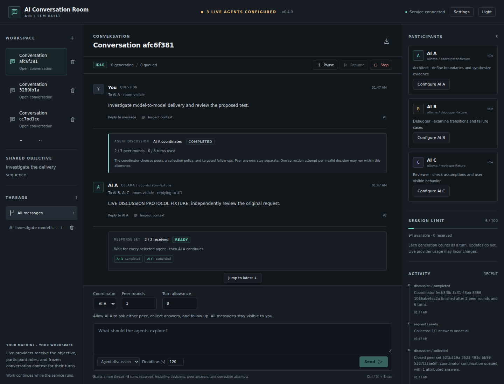
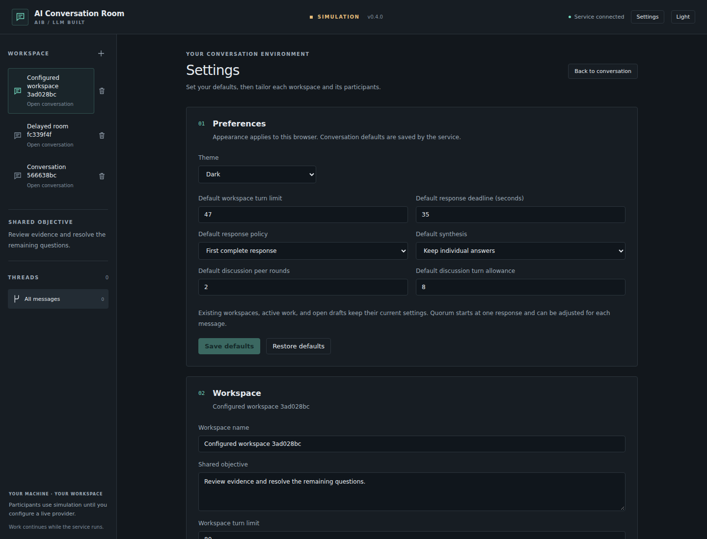

# AI Conversation Room

A local workspace where independent LLM agents answer directed or parallel requests, exchange responses through relays, and coordinate bounded discussions under human control.

**Status:** v0.17.0 adds stale-instruction notices on responses, context inspection, retries, and exports, with explicit unknown legacy provenance. Versioned workspace instructions, readable history, stale-review protection, and frozen request/participant bindings remain available. Saved per-provider and per-workspace request limits remain shared by generations and connection checks, with visible queue capacity holds. Confirmed participant removal remains available with retained history, stable identities/roster numbers, current-slot reuse, and stale-review protection. Bulk workspace archive, restore, and deletion retain exact selections, named previews, cancellation, and atomic confirmation. Optional bounded JavaScript, TypeScript, JSON, and Python highlighting remains available. Safe footnote references and backlinks remain scoped to each message. Pointer and keyboard panel resizing, saved browser widths, and collapsible panels on narrow screens remain available. Participant queue inspection retains exact source threads, dispatch holds, shared capacity, and response prerequisites. Explicit coordinator capability tests remain available before Agent discussion. Safe Markdown/code formatting, original-source views, and message/code copying remain available. Workspace search, thread-content search and naming, and persistent archives are available. Workspaces support 1–8 independent participants, roster management in Settings, and persistent participant configuration history. Node.js 26.10 and Node 24 are supported. A human-selected coordinator can ask active peers, collect all/any/quorum responses, and finish within an enforced round and turn allowance. The application also includes saved conversation defaults, workspace editing, and confirmed workspace/thread deletion. OpenAI, Grok/xAI, Gemini, Ollama, and OpenAI-compatible servers have implemented adapters. Add your provider keys or start a local model, then configure each participant in the app. Provider protocols and browser flows are tested with fixtures; credentialed provider accounts and installed local models have not been verified in this workspace. This release connects through APIs; signed-in ChatGPT/Grok/Gemini website sessions remain a separate, unimplemented transport. AI Conversation Room is the working name for `drkevorkian/AIB_LLM_Built`, inspired by lessons from AI Bridge.

## Overview

AI Conversation Room combines a group chat, threaded discussions, directed messages, parallel requests, and controlled turn-taking. Each agent has a stable identity, an individual context, and its own queue. The application owns delivery, scheduling, permissions, persistence, and recovery.

The central rule is simple:

**Who can see a message, who should answer it, and when they should answer are separate decisions.**

You can ask two agents for independent opinions, wait for both, send their answers to a third agent for synthesis, and ask one participant a targeted follow-up. An automatic relay follows your selected order, including A → C → B → A. Other participants can observe without being required to respond. In **Agent discussion**, a selected coordinator makes its own peer-routing choices and returns a final result. Open-ended conferences and nested peer delegation remain target capabilities.

## Goals

- Enable direct, attributable communication between distinct agents.
- Support multiple instances of the same model as independent participants.
- Run independent work concurrently and dependent work in sequence.
- Preserve original answers, disagreements, evidence, and decisions.
- Give the human clear controls over recipients, context, execution, and cost.
- Resume interrupted work without silently duplicating requests or losing state.
- Keep the conversation engine independent of provider APIs and browser interfaces.
- Make the application understandable through a complete graphical interface.

## Available in v0.18.0

- Record addressed human interjections immediately with normal/urgent priority, inspect their recording-time work, and optionally pause new dispatches without rewriting existing requests.

- Mark model responses whose workspace or author-role instructions were superseded, retain original outcomes and frozen retry context, and disclose missing legacy revision history.

- Create and edit workspace instructions, retain objective/instruction revisions, inspect exact invocation bindings, and reject stale instruction reviews without changing existing snapshots.

- Limit managed requests to 1–4 per provider kind across workspaces and per workspace, including greeting/coordinator checks, with durable settings and read-only queue occupancy.
- Remove a participant permanently from the current roster after an exact-ID review, retain its read-only history and original attribution, and free a slot without reusing its identity or number.
- Manage up to 25 explicitly selected workspaces together through named archive/restore/deletion previews, stale-preview rejection, and an all-or-nothing commit.
- Read Markdown headings, emphasis, lists, quotes, tables, disabled task checkboxes, and scrollable code blocks with language labels.
- Optionally highlight explicitly labeled JavaScript, TypeScript, JSON, and Python code blocks with complete plain-code fallback at fixed resource limits.
- Navigate labeled footnote references and exact backlinks with pointer or keyboard focus inside their own message, without changing the URL or original text.
- Switch each message between formatted and original-source views, copy its stored text, or copy an individual code block, including in archived workspaces.
- Keep streaming text stable until the attempt ends; retain readable source if formatting fails and selectable text if the clipboard is unavailable.
- Search workspace names/objectives and the selected workspace's thread names/messages with literal, case-insensitive matching and safe text previews.
- Rename threads without changing their identities, messages, reply links, frozen context, or pending work.
- Archive and restore workspaces in Settings while retaining full history and consumed usage; archived workspaces cannot invoke models or change conversation data.
- Create workspaces with 1–8 participants; add, deactivate, and reactivate participants in Settings while retaining their identities and history.
- Record every new participant configuration revision, including unused edits, and preserve the original author names and provider/model bindings on historical answers.
- Configurable OpenAI, Grok/xAI, Gemini, Ollama, and OpenAI-compatible text-generation connections, alongside clearly labeled simulation.
- Participant name/role editing, exact model IDs, model discovery, output limits, and connection timeouts.
- A greeting connection test plus an explicit coordinator test that requires a valid completed structured finish decision without scheduling peers or consuming room turns.
- Automatic, configurable relay orders with 1–12 hops, repeated participants, exact reply links, and a complete turn reservation before starting.
- Directed questions, parallel answers, all/any/quorum collection, and optional synthesis after the required answers complete.
- Agent discussions: a selected coordinator chooses peers, collection policy, exact-message follow-ups, and when to finish, with 1–10 peer rounds and a 2–50 turn allowance reserved before starting.
- Strict structured coordinator actions, one bounded correction for an invalid completed decision, repeated-question detection, and a per-discussion Stop control.
- Persistent rooms/objectives/threads, streaming, frozen context inspection, reported token usage, provider request IDs, and Markdown export.
- Per-agent queues with numbered inspection, exact source-thread navigation, frozen model bindings, dispatch holds, and synthesis/coordinator response prerequisites.
- Pause/resume/stop, explicit bounded retries, and restart recovery.
- A dedicated Settings page for theme, saved conversation defaults, workspace name/objective/turn limit, and participant connections.
- Confirmed workspace/thread deletion, cancellation of affected work, removal of copied source context, and an empty state that survives service restart.
- Resizable desktop navigation and participant panels with keyboard controls, browser-persisted widths, Settings reset, and narrow-screen disclosures.
- A responsive React interface with dark/light themes and a loopback-only service with validated local sessions.

New rooms start in simulation so launch does not invoke or bill a provider. Configure participants explicitly to use real models. Missing credentials or failed live requests produce visible failures; they never fall back to simulation.

See [v0.18.0 release notes](docs/releases/0.18.0.md), [human interjection contract](docs/architecture/0019-human-interjections.md), [v0.17.0 release notes](docs/releases/0.17.0.md), [instruction provenance contract](docs/architecture/0018-instruction-provenance.md), [v0.16.0 release notes](docs/releases/0.16.0.md), [workspace instruction contract](docs/architecture/0017-workspace-instructions.md), [v0.15.0 release notes](docs/releases/0.15.0.md), [scoped concurrency contract](docs/architecture/0016-scoped-concurrency.md), [v0.14.0 release notes](docs/releases/0.14.0.md), [participant removal contract](docs/architecture/0015-participant-removal.md), [v0.13.0 release notes](docs/releases/0.13.0.md), [bulk workspace contract](docs/architecture/0014-bulk-workspaces.md), [v0.12.0 release notes](docs/releases/0.12.0.md), [code highlighting contract](docs/architecture/0013-code-highlighting.md), [v0.11.0 release notes](docs/releases/0.11.0.md), [footnote navigation contract](docs/architecture/0012-message-footnotes.md), [v0.10.0 release notes](docs/releases/0.10.0.md), [panel layout contract](docs/architecture/0011-panel-layout.md), [v0.9.0 release notes](docs/releases/0.9.0.md), [queue inspection contract](docs/architecture/0010-participant-queue-inspection.md), [v0.8.0 release notes](docs/releases/0.8.0.md), [coordinator testing contract](docs/architecture/0009-coordinator-capability-tests.md), [v0.7.0 release notes](docs/releases/0.7.0.md), [message presentation contract](docs/architecture/0008-message-presentation.md), [v0.6.0 release notes](docs/releases/0.6.0.md), [workspace organization contract](docs/architecture/0007-workspace-organization.md), [v0.5.0 release notes](docs/releases/0.5.0.md), [participant roster contract](docs/architecture/0006-participant-rosters.md), [v0.4.1 release notes](docs/releases/0.4.1.md), [v0.4.0 release notes](docs/releases/0.4.0.md), [settings/deletion contract](docs/architecture/0005-settings-and-deletion.md), [bounded-discussion contract](docs/architecture/0004-bounded-agent-discussions.md), [language decision](docs/architecture/0001-language-and-runtime.md), [workflow/recovery contract](docs/architecture/0002-workflow-and-recovery.md), and [live-provider contract](docs/architecture/0003-live-providers-and-relay.md).



## Workspace instructions

Enter **Workspace instructions** when creating a workspace or in **Settings → Workspace**. Instructions can contain up to 3,000 characters, preserving whitespace and Unicode exactly. Changing the shared objective or instruction text creates one retained revision; changing the name or limits alone does not. Clearing the field creates a revision with no additional instructions. **Workspace instruction history** shows the objective, exact instructions, revision, and recorded time; archived history stays readable.

Finish or stop pending requests/workflows and wait for connection checks before saving. Restore archived workspaces before editing. Settings saves against the instruction revision you reviewed. If another view changed it, return to the conversation and reopen Settings to review the current instructions before saving again. Unsuccessful saves retain your edits; visiting Settings preserves the message draft.

New questions freeze the current objective, instructions, and participant configuration. Explicit retries and existing relay, synthesis, or discussion continuations retain their original bindings. **Inspect context** shows the frozen text and revision. Older snapshots without these fields remain labeled as unknown; a recovered legacy workspace record identifies only its known current settings and cannot reconstruct earlier edits. Human instructions guide model responses within the application's existing permissions; they cannot change identities, routing grants, controls, or execution authority.

Live turns send these frozen instructions to the selected provider. Greeting and coordinator connection tests omit workspace instructions, objectives, and conversation history. Instruction text counts toward the 64,000-character context bound; oversized contexts fail explicitly. Markdown export includes workspace revision history and each recorded invocation's instruction revision. Deleting a thread retains workspace instruction history; deleting the workspace removes it with the other retained workspace data.

## Stale instruction notices

A **Stale instructions** note marks a response whose frozen workspace instructions or author's role instructions have been superseded. **Inspect context** shows the original instructions and the reason. A newer workspace instruction revision supersedes an older one even if the original text is later restored. Retained role changes also keep an earlier response stale when the role text is restored. Name, provider/model, activation, output, timeout, and workspace-limit edits alone do not create instruction supersession.

Legacy records with missing instruction versions or gaps in role history show **Instruction provenance unknown**. A known objective/role difference can establish staleness even when another part of the history is unknown. The comparison uses the exact workspace and author identity. Peer-role changes alone do not revise another author's role instructions. Inconsistent records are labeled unknown instead of inventing a version relationship.

Staleness is shown separately from the original completed, failed, refused, cancelled, interrupted, or streaming outcome. Reading, source view, copying, archived inspection, and exports retain the original body and snapshot. Export annotations describe the current comparison at export time. **Retry this attempt** warns when its original instructions are stale or unknown and continues to use its frozen context. Ask a new question to use current instructions; replying to a completed old response uses current settings with the original source text.

These notices are read-only comparisons. They do not cancel or reclassify attempts, change response sets or workflow eligibility, resume work, consume/refund turns, or put annotation text into provider context. Workspace/configuration edits retain pending-work and archive locks. Recorded interjections are available; revised-task correction policies, task supersession, revised obligations, and stale-result dependency exclusion remain separate unfinished items.

## Resizing and collapsing panels

On screens wider than 1000 px, drag either divider to resize the navigation or participant panel. Tab to a divider and use **Left/Right** arrows to move it by 10 px, or **Shift + Left/Right** for 50 px. **Home/End** select the panel's minimum/maximum width. **Escape** cancels an active drag; pointer cancellation or a transition to Settings/narrow screens also restores the previous width. Completed drags and keyboard adjustments save in this browser for subsequent views/reloads. These controls apply to presentation and never change conversation data or invoke a provider.

Navigation widths range from 180–420 px and participant widths from 230–480 px. Both shrink within these bounds when needed to retain at least 400 px for the desktop conversation. A smaller viewport does not overwrite the saved wider-screen preference; an explicit resize saves the widths currently chosen in that view. Settings has **Reset panel widths** to restore responsive defaults and reopen collapsed panels. Malformed saved values use defaults. If browser storage is unavailable, resizing still applies to the open view and a visible notice explains that it cannot save.

At 1000 px or below, desktop dividers and saved widths give way to the compact layout. **Hide/Show navigation** and **Hide/Show participants** collapse panels independently. Conversation controls and pending-response status stay in the conversation; both workspace Stop and Stop discussion remain available. Panels stay mounted, retaining drafts, selections, and disclosures. Narrow collapse choices last for the open view; desktop panels remain visible, and reload reopens compact panels. Preferences are local to this browser origin, without service-wide or live cross-tab synchronization.

## Removing participants

In **Settings → Participants & connections**, choose **Remove** for the exact participant. The named confirmation shows its workspace and participant IDs, retained-message/configuration counts, and effects. **Cancel**, Escape, or closing the dialog before confirmation leaves the roster unchanged. Confirmation binds to the reviewed workspace revision; changes require closing and reviewing again. While applying, closing/cancellation is held. A lost response requires **Close and refresh participants** to inspect the actual result; removal is never automatically repeated.

Removal permanently retires that identity, while deactivation remains reversible. Keep at least one active participant. Finish or stop all queued/running work and unfinished workflows, and wait for probes/request cleanup before removal. Archived workspaces require restoration. Removal does not cancel work, refund turns, resume the room, invoke a provider, erase history, or retract text already sent/exported.

The current roster still has at most eight identities, including inactive ones. Removal frees a current slot; a replacement starts in simulation with a fresh ID and a new, never-reused roster number. **Removed participants** exposes retained settings/history read-only. Original messages, author labels, response sets, usage, workflows, and frozen snapshots remain. Removed identities cannot be edited, reactivated, addressed, tested, or used by a retry requiring them. A same-named replacement cannot inherit their replies, grants, or obligations.

New questions omit removed identities' roles/connections from their roster but may include their retained room-visible messages. Otherwise eligible retries preserve their original frozen context, including removed observers; removal is not a privacy control. Other open views preserve drafts, prune unavailable selections/reply targets, and leave replacements unselected until explicitly chosen. Thread deletion applies its existing conversation/context deletion rules; retained participant configurations remain until whole-workspace deletion. No forensic erasure, external backup cleanup, or provider-submission retraction is promised.

## Managing several workspaces

Choose **Manage workspaces** in navigation, select up to 25 exact workspaces, and choose Archive, Restore, or Delete. Search and active/archived/all filters use literal name/objective matching. Changing a filter clears selection; duplicate names show separate workspace IDs. **Preview selected workspaces** lists the exact names, IDs, history counts, pending work, connection tests, and effects. Cancel, Escape, closing the dialog, or returning to selection abandons the preview without changing workspaces. Cancellation is available until confirmation starts; a committed operation cannot be cancelled or undone.

Confirm applies the entire selection together or leaves every selected workspace untouched. Pending work or connection tests block archive for the whole batch. Archive retains full history and consumed usage; restore leaves restored workspaces paused and already active workspaces unchanged. Deletion commits removal before aborting affected streams/probes and retains unselected workspaces. Local history is logically deleted; provider submissions, exports, external backups, and disk remnants cannot be retracted or securely erased by this control.

Previews expire after five minutes and are invalid after selected history, settings, or activity changes, cancellation, confirmation, or service restart. Obtain a new preview when rejected. A lost confirmation response requires closing and refreshing to inspect the actual state before another operation; it is never automatically replayed. The current conversation and draft stay mounted while choosing, cancelling, archiving, or restoring. Deleting the selected conversation clears it as in single-workspace deletion.

## Reading and copying messages

Completed messages support Markdown headings, emphasis, lists, blockquotes, tables, task lists, inline code, and fenced/indented code blocks. Message headings stay below the workspace heading. Code blocks and wide tables scroll within the conversation on narrow screens. Task checkboxes show source state and cannot be toggled. Code stays plain by default. **Highlight code** optionally colors one explicitly labeled block; **Plain code** turns it off. Supported fence labels are `javascript`/`js`, `typescript`/`ts`, `json`, and `python`/`py`, regardless of case. Unlabeled, indented, and unsupported blocks stay plain; no language is guessed from content.

Highlighting is a lexical reading aid, not syntax validation or a full language parser. It never executes code or fetches a grammar. Each block is limited to 20,000 UTF-16 code units, 1,000 lines, and 2,000 coalesced token runs. Above a limit, the complete code remains plain with a notice; copying retains every character. The choice lasts only for that mounted block and exact text/language, resets after source/formatted toggles or reload, and survives theme changes. It does not change workspace data, requests, permissions, or turn use.

**View source** shows the stored message body; **View formatted** returns to Markdown. **Copy message** copies that body, including Markdown, without attribution labels or other interface text. While an answer streams, it copies the text available at that click. **Copy code** copies just the displayed code content; Markdown parsing normalizes code line endings and may add a final newline. Copying never reads your clipboard or sends another provider request. If clipboard access is missing or denied, a visible message explains manual copying, and whole-message copying opens the selectable source view.

Streaming text stays literal until the attempt ends. Completed, failed, cancelled, and interrupted attempts may show formatted text; their original status remains visible, and formatting does not make a partial answer complete. The formatter loads separately and falls back to readable source if it cannot load or render. Reload after fixing a module-load problem to restore formatting. Source-view and copy feedback are per-view and reset on reload.

Raw HTML remains escaped text. Image references show alt-text placeholders without loading local or remote images. Only explicit HTTP(S) links without embedded credentials are clickable, opening in a new tab without an opener or referrer. Relative links, fragments, non-web schemes, and malformed/unsafe destinations remain labels. Links never open automatically. These rules also apply to LLM-authored messages. Formatting has no routing or execution authority; frozen context, literal search previews, and exports keep the original text. Attachment upload/previews, mathematical typesetting, and Mermaid rendering remain planned. An exported transcript is Markdown source; other viewers have their own rendering rules.

**Footnotes** use labeled reference and backlink buttons. Click or press **Enter/Space** to move focus to the exact note or reference inside that message. Repeated labels and references remain separate across messages. Navigation never changes the URL, fragment, history, or selected thread. Source/formatted toggles retain IDs within the mounted message; a full reload may allocate new IDs. Ordinary authored fragment links remain blocked.

Up to 100 notes and 300 reference occurrences per message receive navigation controls. Above either limit, the parsed notes remain readable with a notice and inert labels; View source and Copy message preserve the full body. This bounds interactive controls rather than total Markdown nodes or long-history rendering.

## Inspecting participant queues

Expand **Inspect queue** on a participant card to see its running generation and queued entries in stored order. Each entry names its source thread, frozen provider/model, queue time, and applicable response deadline. **Open thread** selects that exact conversation while preserving the composer draft. Queue inspection only reads state; use the existing Pause, Resume, Stop, or explicit Retry controls to change execution.

Specific reasons explain workspace pauses, another request or connection check for that participant, earlier queue entries, shared service capacity, provider/workspace request limits, and enforced turn/deadline limits. The service shares four managed request slots across all workspaces and probes. Queue details show the workspace occupancy and each job’s frozen-provider occupancy; other workspaces contribute anonymous counts only. Observation times and slot counts describe the current snapshot; readiness does not guarantee a start time or global fairness. A disconnected view identifies last-observed data, and **Refresh queue details** retries an unavailable read without calling a provider.

**Response prerequisites** identifies synthesis or a coordinator continuation waiting for eligible completed answers, including the saved all/any/quorum threshold and each respondent's latest outcome. These are future continuations, not queued generations. Failures/refusals/interruption remain explicit; inspection never retries them. The barrier disappears when the engine actually creates its continuation, or when its work is stopped/deleted. Closed response sets' old deadlines do not prevent their queued synthesis from running. Archived queue details remain readable. Reordering, priorities, estimated starts, and richer dependency inspection remain planned.

## Request concurrency limits

In **Settings → Preferences → Provider request limits**, save a limit from 1–4 for each provider kind, including simulation. A provider kind shares its allowance across all workspaces, models, accounts, and endpoints; different OpenAI-compatible servers share one allowance. In **Settings → Workspace**, save the **Workspace request limit** from 1–4 after finishing or stopping pending work and connection checks. Archived workspaces require restoration before editing. New and legacy settings default to four, preserving previous dispatch behavior. Conversation-default saves and **Restore defaults** preserve provider limits.

Generations and greeting/coordinator checks count toward both scoped allowances and the existing four service slots. Each participant still runs at most one managed request. A queued or retried job uses its original frozen provider binding. A blocked scope holds the request without claiming an attempt or consuming another turn; eligible work in other scopes can still start. Lowering a provider limit lets active requests finish and holds new starts until occupancy is below the new allowance. Raising it may start already authorized queued work at the next scheduler pass. Neither edit resumes paused rooms, cancels work, retries failures, or changes frozen model context.

Completed or stopped requests retain their slots while transport cleanup finishes. Confirmed workspace/thread deletion keeps the existing immediate local capacity release after committing deletion and aborting affected requests. These are limits on requests managed by this service, not guarantees about remote execution, provider rate limits, billing, or cancellation. Independent services, external submissions, and remote processing after an abort are outside this accounting. Fair queues, priorities, rate/token budgets, and distributed workers remain planned.

## Planned capabilities

| Capability            | Intended behavior                                                      |
| --------------------- | ---------------------------------------------------------------------- |
| Shared room           | A persistent objective, roster, instructions, and conversation         |
| Threads               | Separate discussions linked to their originating messages              |
| Directed requests     | Explicit recipients and exact reply targets                            |
| Parallel consultation | Multiple agents answer from the same shared context snapshot           |
| Response collection   | Attributed answers collected against a defined completion policy       |
| Cross-review          | One agent reviews another's completed answer or artifact               |
| Fixed relay           | Configurable order, including A → C → B → A                            |
| Conference discussion | A controlled speaking queue and bounded follow-ups                     |
| Artifact exchange     | Versioned attachments with authorship and access controls              |
| Recovery              | Durable queues, checkpoints, reconciliation, and explicit continuation |
| Human control         | Start, pause, resume, stop, interject, redirect, and inspect           |
| Observability         | Delivery states, missing responses, context versions, and usage        |

## Getting started

Install **Node.js 26.10 or newer in the 26.x series**. **Node.js 24.15 or newer in the 24.x series** is also supported. `.nvmrc` selects 26.10.0 when using nvm. This build was verified on Linux with Node 26.10.0 and 24.19.0. CI checks both versions on Linux, Windows, and macOS; Chromium UI coverage runs on Linux for both runtimes. A native desktop installer is planned.

```sh
git clone https://github.com/drkevorkian/AIB_LLM_Built.git
cd AIB_LLM_Built
npm ci
npm run dev
```

Open **http://127.0.0.1:4317**. The first launch creates a room with AI A, AI B, and AI C. The default composer asks B and C independently, then queues A to synthesize their completed answers. Turn off synthesis or change the recipients for a directed conversation. Choose **Update · no reply** to share information without invoking anyone. Click a participant's **Configure** button to select actual models. New workspaces let you choose 1–8 participants and have independent participant settings. A single-participant workspace starts with a directed request; larger workspaces default to parallel answers and synthesis by the first active participant.

The client updates during development. Restart the service after server-source changes. To run built assets:

```sh
npm run build
npm start
```

The service continues working if the browser view closes. Pause or stop from the UI to control work; press Ctrl+C in the service terminal to shut it down. On restart, unfinished rooms are paused. Queued jobs remain queued; interrupted jobs require an explicit retry and are never replayed automatically.

### Connect real models

1. Copy `.env.example` to `.env` in the repository directory. For a cloud provider, set `OPENAI_API_KEY`, `XAI_API_KEY`, or `GEMINI_API_KEY` locally. Restart the service after changing keys. Environment variables already set in the service take precedence over `.env`.
2. Click **Configure** on a participant card or in Settings. Choose its provider, edit its role, and enter the exact text-generation model ID. **Load available models** reads the provider catalog; some catalog entries may not support text generation.
3. Save the settings. **Test connection** sends a short greeting request through the selected connection. This test may incur provider charges and does not consume the room turn budget. It sends participant roles but no thread history or shared objective.
4. Before using a participant as an Agent discussion coordinator, click **Test coordinator**. It sends one structured-output test using the saved connection and roles, with no thread history or workspace objective. Success names the requested provider/model, configuration revision, and test time. Simulation is explicitly labeled. The result is temporary and clears when you edit the form or reopen/reload it. Each test may incur provider charges, uses no room turns, and is limited to 30 seconds or the saved timeout if shorter. A failure never automatically retries, repairs, or falls back to a greeting/simulation; retry explicitly after checking the connection. This is evidence for that configuration at that time, not a guarantee of later discussions.
5. Send a question, parallel consultation, relay, or agent discussion. Active participants may use different providers, or independent instances of the same provider/model.

For **Ollama**, start Ollama on your machine and install a model in it. Select **Ollama (local)**, use `http://127.0.0.1:11434`, and load/select the installed model. No cloud API key is needed. The adapter accepts loopback servers only.

For an **OpenAI-compatible server**, enter its base URL, including `/v1` when required by that server. HTTPS is required except on localhost. Set `AIB_COMPATIBLE_API_KEY` in the service if your server requires bearer authentication. Redirects are rejected to prevent forwarding credentials to a different endpoint. Compatibility depends on the server implementing streamed Chat Completions with a complete `stop` outcome. A discussion coordinator additionally requires JSON Schema structured-output support; ordinary peer answers remain plain text. **Test coordinator** checks that capability with one completed structured finish decision. It does not verify every future discussion or peer-routing choice.

Provider keys remain in the service environment. They are absent from room records, snapshots, browser responses, and exports. A local `.env` file is ignored by Git but is still a plaintext file on your machine; restrict its filesystem access. OS keychain storage is planned. API access, billing, and model permissions are separate from website sessions/subscriptions.

### Choose a conversation flow

- **Directed:** select one participant and disable synthesis. Its answer is attributed to it; other agents remain observers. **Reply to AI B**, for example, selects B and preserves the exact reply target.
- **Parallel:** select multiple participants. They receive the same initial context and answer independently. Choose all/any/quorum and optionally a separate synthesizer.
- **Relay:** choose **Automatic relay** in the composer and edit the ordered steps. With the initial three participants the default is A → C → B → A; it adapts to other active rosters. Each completed answer goes to the next participant; the final answer returns to you. Failure or refusal blocks advancement. Pause holds new hops, and Stop cancels remaining hops. The deadline applies to each hop.
- **Agent discussion:** select a coordinator, peer-round limit, and turn allowance. The coordinator can ask one or more permitted active peers concurrently, choose all/any/quorum, follow up to a specific answer, then return a final result. A single-participant coordinator may finish without peer requests. Decisions, peer answers, correction attempts, and explicit retries all consume the allowance. The default reserves 12 turns and allows 3 peer rounds; unused turns are released when finished or stopped. A round deadline covers the queue and generation time for that decision or peer set. **Stop discussion** cancels only that discussion; room controls still apply to all work.
- **Update:** share information with no new generation.
- **Human interjection:** select recipients and normal/urgent priority, then choose **Pause new dispatches** or **Record only**. **Record interjection** persists the message and control event immediately, even while a response is active. Priority is a retained human label, not queue ordering. The message creates no generation or response obligations. New questions include it as room-visible human context. Pause applies across the workspace; active answers may finish, and queued work keeps its original snapshot. Resume continues that original work. To change the task, use Stop and ask a new question; applying corrections to existing obligations remains planned.

A discussion keeps its submitted objective, roles, and base context frozen. Later updates do not silently replace that context. All/any/quorum closure records the exact included peer answers. Late answers remain separate and do not rewrite the coordinator’s continuation; unfinished late respondents are cancelled when the coordinator finishes. The coordinator may finish without asking peers when the task or allowance calls for it. Exceeding a limit produces a blocked state rather than an invented final answer.

Participant and workspace settings cannot be edited while queued/running work, a blocked relay, an unfinished discussion, or a connection probe remains. Finish or stop pending work first. Previously recorded invocation snapshots retain their original provider, model, role, and objective. Explicit retries retain the original bindings too; send a new question to use revised settings. If a participant required by a failed workflow has been deactivated, reactivate it before retrying. If it has been removed, ask a new question with current participants; a replacement cannot acquire its old identity or workflow obligations.

### Settings and workspace management

Click **Settings** in the header to open the dedicated page; `http://127.0.0.1:4317/#settings` also opens it directly. In this release each sidebar workspace is one conversation room; there is no additional workspace/group hierarchy.

- **Preferences:** choose a theme and save defaults for new workspace turn limits, response deadlines, all/any/quorum collection, synthesis, discussion peer rounds, and discussion turn allowances. Theme stays in this browser; conversation defaults are stored in SQLite and shared by views of the same service. Existing workspaces, active work, and open composers keep their values. Visiting Settings preserves the open composer draft.
- **Workspace:** edit the selected workspace's name, shared objective, instructions, turn limit, and request limit. Inspect retained objective/instruction revisions. Finish or stop pending work and wait for connection checks first. The turn limit cannot be below turns already used. New requests use current instructions; existing invocation bindings remain recorded.
- **Participants & connections:** add a participant, deactivate/reactivate or permanently remove an existing identity, inspect retained configuration history, or configure a current identity's role, provider/model, output limit, and timeout. New participants start in simulation; connection tests require an active participant. Keep at least one active participant. The eight-current-identity limit includes inactive participants. Removed identities retain read-only messages, settings, usage, and history while freeing a current slot. Names may repeat; the UI adds a roster number to distinguish duplicate names. API credentials remain in the service environment/`.env`; Settings displays their availability without receiving key values.
- **Search:** use **Search workspaces** to match names or objectives and choose **Active**, **Archived**, or **All workspaces**. **Search threads** matches names and retained message text in the selected workspace, including streamed text as it arrives. Matching previews are plain text. Search keeps the selected conversation and open draft; choosing a result opens the full thread. Queries are local to the open view, use literal case-insensitive matching, and clear on reload. Thread search resets when changing workspaces.
- **Rename thread:** click its pencil button, enter a name of 1–100 characters, then save or cancel. Naming can happen during active work because it changes only the thread label. Other views and exports use the updated name; routing, message IDs, reply links, invocation context, and usage stay unchanged.
- **Archive workspace:** use Settings and confirm the named workspace. Finish or stop queued/running work and unfinished workflows first; connection probes must finish. Archiving pauses the workspace and retains its participants, threads, messages, attempts, snapshots, workflows, history, and consumed usage. Archived conversations support reading, searching, inspection, export, restoration, and whole-workspace deletion. Editing, sending, retrying, controls, thread deletion/renaming, roster changes, and connection tests require restoration. An already open draft stays in place with its controls disabled.
- **Restore workspace:** use Settings or the archived-conversation notice and confirm. Restoration returns it to the active list and keeps it paused; **Resume** is explicit. Restoration does not replay failed/cancelled work or refund used turns. If only archived workspaces remain, the app opens an archived workspace after restart without creating another welcome room.
- **Delete workspace:** use the trash button beside its sidebar entry or the action at the end of Settings, then confirm the named workspace. This removes its participants, threads, messages, requests, attempts, snapshots, workflows, and local activity. Active generations and connection probes are aborted. Other workspaces remain usable. Deleting the final workspace leaves an empty app, including after restart; **Create workspace** starts a new one.
- **Delete thread:** use its sidebar trash button and confirm. Its messages, attempts, response sets, relays, and discussions are removed. Stored copies of its messages are also removed from surviving context snapshots. Pending work using that context is cancelled, unused reservations are released, and consumed turns remain counted. Surviving completed answers remain in their threads; a redaction notice identifies historical context changes. Attempts with redacted context cannot be retried; ask a new question instead.

Roster changes update other open views. An open composer keeps its draft, removes inactive recipients and relay steps, and adjusts invalid coordinator, synthesis, or quorum choices. Added/reactivated participants remain observers until explicitly selected. Deactivation prevents new generations; it does not hide room-visible messages or remove historical context. New edits record full configurations from v0.5.0 onward. Older workspaces recover configurations present in their snapshots and current settings; previously unrecorded unused edits cannot be reconstructed.

Deletion is permanent within the app and updates other open views. It is logical deletion from active records, not a promise of forensic disk erasure. It cannot retract provider submissions, exported transcripts, external backups, or text already incorporated into answers in another thread. Minimal deleted-command UUIDs remain to reject delayed replay; they retain no message text or command hash. Export first if you need a transcript.



### Configuration and data

| Setting            | Default                               | Meaning                                                  |
| ------------------ | ------------------------------------- | -------------------------------------------------------- |
| `AIB_PORT`         | `4317`                                | Loopback service port; remote binding is not supported   |
| `AIB_DATA_DIR`     | Platform-specific user data directory | Directory containing `rooms.sqlite` and its writer lease |
| `AIB_BROWSER_PATH` | Playwright-managed Chromium           | Optional existing Chromium executable for UI tests only  |

Default application data locations:

- Linux: `$XDG_DATA_HOME/AIB_LLM_Built`, or `~/.local/share/AIB_LLM_Built`.
- Windows: `%LOCALAPPDATA%/AIB_LLM_Built`, or the user home directory if that variable is unavailable.
- macOS: `~/Library/Application Support/AIB_LLM_Built`.

Example local override in Bash:

```sh
AIB_DATA_DIR=.data/local AIB_PORT=4317 npm run dev
```

In PowerShell:

```powershell
$env:AIB_DATA_DIR = ".data/local"
$env:AIB_PORT = "4317"
npm run dev
```

`npm run dev` and `npm start` automatically load an optional local `.env` file using Node’s native loader. Local databases and secrets are ignored by Git. Do not run two application processes against the same data directory: the writer lease intentionally rejects the second process.

### Verification

```sh
npm run check
npm run build
npx playwright install chromium
npm run test:ui
```

The v0.14.0 suite includes 234 engine/service/provider-protocol/rendering tests and 52 Chromium UI tests. Required verification covers both Node 26.10.0 and 24.19.0; exact completed checks and commit/run links are recorded in `LLM_Recovery_Prompt.md`. Coverage includes confirmed removal, strict revision/scope, last-active/capacity rules, irreversible eligibility, pending workflow/probe/cleanup locks, retained snapshots and original retry bindings, retired-ID collision rejection, legacy ordinal recovery, database rollback, cross-view drafts and replacement selection, lost removal responses, exact bulk scope, preview expiry/cancellation, stale records and probes, rollback after forced database write failures, active transport cancellation, lost confirmation responses, persistent empty state, explicit-language highlighting, escaped token output, Unicode and unfinished syntax, exact resource boundaries, token-color contrast in both themes, keyboard toggles, plain fallback, source/code provenance, message-scoped footnote IDs/focus/backlinks, parser label collisions, blocked authored fragments, navigation bounds, literal streams and partial-answer status, pointer capture/cancellation, keyboard sizing/bounds, browser width persistence/reset, invalid/unavailable storage, responsive collapse/drafts, visible Stop controls, unchanged room records, Markdown safety, exact source/code copying, denied or missing clipboard APIs, split streams, failed partial code, formatter-load failure, delayed post-send history refresh and retained drafts/selection, source/context/export preservation, archives and explicit restoration, read-only archive commands, scoped renaming during active work, safe search previews, archive-only service restart, variable rosters, activation, configuration history, frozen retry bindings, independent duplicate names, cross-view drafts, and persistence/restart. Protocol fixtures exercise the production adapters over streamed HTTP, including relay and a six-turn coordinator → parallel peers → targeted review → final result flow. These checks do not establish availability of your cloud account or installed local model. Browser tests use a fresh temporary data directory for each run, separate from normal application data. See [CONTRIBUTING.md](CONTRIBUTING.md) for development boundaries.

To exercise failure handling in simulation, include `[simulate:fail]`, `[simulate:refuse]`, or `[simulate:slow]` in a question. Use `[simulate:follow-up]` in an agent discussion to demonstrate a second round targeting the first peer’s exact answer. These markers belong to simulation and have no special behavior in live providers.

## Current implementation limits

The rest of this README specifies the full target design. The checked TODO items at the end record completed work; unchecked items remain planned.

The current build supports live text-generation API calls, human-directed requests/updates, synthesis, fixed relays, and bounded coordinator discussions. The selected coordinator can ask peers and finish through validated structured actions. Peers answer without delegation permission. Coordinators cannot change identity, permissions, limits, or room controls. Nested delegation, autonomous tools, and open-ended conferences are not implemented. Each workspace has 1–8 current participant identities, including inactive identities; at least one stays active. Current participants' names, roles, providers, and models are editable. Removed identities remain in read-only retained history and are excluded from new-question rosters. The service runs at most four generations concurrently and one per participant.

All messages are room-visible. All/any/quorum are the implemented collection policies. Timeout cancels unfinished work for the affected request and pauses the room; deadlines continue while paused. Each provider also has a connection timeout. Reported usage is stored per attempt; monetary cost estimates and enforced token/cost budgets are not implemented.

Signed-in browser-session transport, current rosters above eight identities, membership changes during pending workflows, unrestricted agent send types, nested peer delegation, assigned cross-review rounds, conference speaking queues, attachments, private threads, summaries, imports, backup tools, and installers remain planned. Remote acceptance/reconciliation is incomplete. Provider/network failures are never automatically retried. A confirmed completed but invalid coordinator action can receive one new correction invocation within the reserved allowance; this may incur charges. Explicit retries may also incur another charge if the first request reached the provider. Stop aborts the local request, but a provider may continue processing or billing a request it already accepted.

Initial limits are 12,000 characters per command, 20,000 per provider answer, and 64,000 per context snapshot, including its objective and workspace instructions. Oversized contexts are rejected explicitly; history is not silently truncated. The persistence layer is a transactional room-document store for a single service, with a separate SQLite writer lease. Multi-worker scheduling and large-history pagination are planned.

Search uses workspace metadata and the selected workspace's retained room-visible messages already loaded by the client. Advanced query syntax, global message search across workspaces, ranking/indexing, workspace groups and saved views, thread archive, and message-body editing remain planned. Archived workspaces are retained data, not backups or a privacy boundary.

## Conversation model

### Participants

An agent is a configured participant, not a provider name. AI A and AI B may use the same provider and model while retaining separate roles, context histories, queues, and identities.

The application assigns author identity. A message body cannot impersonate another participant. Renaming an agent changes its display label without changing historical attribution. Changing its model or role creates a recorded configuration revision.

The human is a first-class participant and can address the room or a specific agent. Agent messages cannot increase their own privileges or replace human instructions.

### Addressing and visibility

Every message distinguishes its audience from its intended respondents. Room-visible directed messages are the default. Restricted threads may be added with explicit access controls; merely addressing one agent does not make a message private.

Observers receive relevant messages as context on a subsequent invocation. Visibility alone does not trigger a new generation. Mentioning an agent in prose is also not a scheduling instruction.

The composer displays recipients and visibility before submission. Model-generated sends use a validated structured action. Unknown, inactive, ambiguous, or unauthorized recipients produce an explicit routing error. No silent fallback to another agent is allowed.

### Message types

| Type                | Meaning                                              | Default scheduling effect                                |
| ------------------- | ---------------------------------------------------- | -------------------------------------------------------- |
| Question/task       | Requests a response or deliverable                   | Creates tracked obligations                              |
| Answer              | Responds to an existing request                      | Updates that request's response set                      |
| Critique            | Reviews a specific claim or artifact                 | Requires an explicit follow-up request to summon a reply |
| Update              | Shares information                                   | No automatic reply                                       |
| Proposal            | Suggests a course of action                          | No automatic adoption                                    |
| Decision            | Records an authorized resolution                     | Updates decision state within assigned authority         |
| Human-input request | Identifies a missing human decision                  | Blocks the affected work according to scope              |
| Control event       | Records pause, cancellation, or configuration change | Executed only through authorized application controls    |

These types describe public contributions. The application does not require agents to disclose hidden internal reasoning; concise explanations, evidence, assumptions, and conclusions are sufficient.

### Parallel questions and response sets

A request addressed to B and C creates one parent request and two recipient obligations. Both receive the same shared snapshot, plus their explicitly recorded individual role and context. Independent-answer mode withholds sibling answers until each initial answer is committed.

Responses stream into the interface separately. Downstream synthesis waits for the configured collection policy; displaying an answer does not automatically release dependent work.

| Policy   | Completion rule                                                                   |
| -------- | --------------------------------------------------------------------------------- |
| All      | Every required recipient supplies an eligible completed answer                    |
| Any      | The first eligible completed answer releases downstream work                      |
| Quorum   | A configured number of distinct recipients supply eligible answers                |
| Deadline | At the deadline, use the available response set if the minimum requirement is met |
| No reply | Informational delivery creates no answer obligation                               |

Each policy specifies timeout behavior: keep waiting, pause, or proceed with an explicitly incomplete set. Errors, refusals, cancellations, empty outputs, and malformed structured results remain visible outcomes; they do not silently count as eligible answers. A refusal can be a terminal recipient outcome while leaving the parent request unable to meet its success policy.

When a collection closes, it records exactly which messages were included. Late answers remain attributed and visible; they do not silently alter an already-published synthesis. A follow-up synthesis can incorporate them. Any/quorum policies also specify whether remaining work continues or is cancelled.

A response set preserves each original answer. A synthesis is a separate authored message linked to the included answers, with missing participants and unresolved disagreements identified.

### Directed follow-ups

If B identifies a race condition and C proposes an interface, A can create two requests:

- A → B, replying to B's message: identify the exact transition that allows a duplicate send.
- A → C, replying to C's message: show how queued, submitted, and completed states appear.

These requests can run concurrently. A can instead question B while leaving C as an observer. Each answer links to the specific request and thread, not merely to the latest room message.

### Conversation modes

| Mode                  | Scheduling rule                                          | Typical use                     |
| --------------------- | -------------------------------------------------------- | ------------------------------- |
| Directed              | Invoke only explicitly selected respondents              | Targeted questions              |
| Parallel consultation | Dispatch independent requests, collect, then synthesize  | Comparing approaches            |
| Peer review           | Independent answers followed by assigned cross-critiques | Finding errors and omissions    |
| Parallel tasks        | Execute independent tasks against agreed interfaces      | Dividing work                   |
| Conference            | Maintain a fair speaking queue and explicit follow-ups   | Open discussion                 |
| Fixed relay           | Follow the selected participant order                    | Predictable sequential dialogue |

In fixed relay, addressing and speaking order remain distinct. A message to B does not silently move B ahead of C. The selected policy determines whether the message waits until B's turn or the human explicitly changes the order.

The default investigation pattern is independent answers → targeted cross-review → synthesis. Additional rounds require unresolved work and remaining limits. Agreement alone is not evidence of correctness.

### Completion and stopping

Questions create obligations; answers resolve them. Updates do not create reply chains. A thread becomes idle when it has no runnable or outstanding work. Idle does not necessarily mean the objective is accomplished.

A room can finish successfully, finish with unresolved issues, pause for human input, exhaust its limits, or be stopped. The application records the actual reason. It must not label a session successful merely because every agent agrees or no agent is speaking.

## Example session

1. The human asks A to investigate duplicate message delivery.
2. A sends the same question concurrently to B and C with an `all` response policy.
3. B's answer appears first. The interface shows C as pending; synthesis does not start.
4. C finishes. The application closes the initial response set.
5. A compares both answers and asks B about the suspected race and C about recovery behavior.
6. B and C answer their respective follow-ups.
7. A publishes a synthesis that links the evidence, proposed fix, and remaining uncertainty.
8. The thread becomes idle. Further implementation requires a task with appropriate permissions.

If the human changes the requirement during step 5, the new instruction is recorded immediately. Existing generations are marked as using the earlier snapshot. Dependent work is held until the configured correction policy has been applied.

## System architecture

| Component           | Responsibility                                                            |
| ------------------- | ------------------------------------------------------------------------- |
| Graphical client    | Room, thread, roster, composer, controls, and inspection views            |
| Application service | Authenticated commands, validation, and authoritative state               |
| Conversation engine | Requests, obligations, response sets, dependencies, and mode rules        |
| Scheduler           | Per-agent queues, fairness, limits, deadlines, leases, and cancellation   |
| Context builder     | Authorized snapshot assembly, summaries, retrieval, and token budgets     |
| Provider adapters   | Translate invocations and normalize provider lifecycle events             |
| Persistent store    | Events, message records, queues, checkpoints, and configuration revisions |
| Artifact store      | Original files, immutable versions, hashes, previews, and permissions     |
| Policy layer        | Authorization, tool boundaries, visibility, and routing validation        |
| Diagnostics         | Redacted logs, metrics, usage estimates, and recovery explanations        |

The initial deployment should be a local application service with a graphical client and durable local storage. A desktop wrapper or local browser interface is an implementation decision. Remote multi-user hosting is a separate scope and must not be implied by local operation.

The service remains authoritative if a view disconnects. Whether work continues after closing the client is an explicit setting shown to the user. Persistent state must survive process restarts regardless of that setting.

### Core entities

Workspace, room, participant, participant revision, thread, message, request, recipient obligation, invocation, delivery attempt, response set, decision, artifact version, context snapshot, checkpoint, and audit event each require stable identifiers.

Logical messages and delivery attempts are different entities. A retry may create another attempt without creating another logical request. A regenerated answer is a distinct revision, with the earlier result preserved.

### Illustrative message envelope

This is a proposed internal contract, not an existing public API. The server supplies trusted identity, timestamps, and sequence numbers after validating a send action.

```json
{
  "schema_version": 1,
  "message_id": "msg_0142",
  "room_id": "room_01",
  "thread_id": "thread_delivery",
  "author_id": "agent_a",
  "recipient_ids": ["agent_b", "agent_c"],
  "visibility": { "scope": "room" },
  "type": "question",
  "reply_to_message_id": "msg_0139",
  "request_id": "req_0070",
  "context_snapshot_id": "ctx_0380",
  "response_policy": {
    "mode": "all",
    "deadline_seconds": 120,
    "on_timeout": "pause",
    "remaining_work": "continue"
  },
  "body": "Independently identify the likely duplicate-send failure.",
  "artifact_version_ids": [],
  "created_at": "2026-10-01T00:00:00Z"
}
```

The example deadline is illustrative, not a universal timeout. Each response references its parent request and exact reply target. Validation requires recipients to belong to the room and have access to the message, its thread, and referenced artifacts.

## Scheduling and delivery

One active generation per logical agent is the initial invariant. Different agents may run concurrently, subject to provider and workspace limits. Queued work includes dependencies and priorities; dependency cycles are rejected or surfaced as blocked work.

The application persists the request and dispatch intent before sending. Workers use durable claims and fencing so a stale worker cannot commit over a newer owner. Provider submissions, local commits, and stream receipts are correlated by attempt ID.

Delivery and generation have separate states. A delivery can be queued, submitting, accepted, failed, cancelled, or uncertain. An invocation can be waiting, generating, completed, failed, cancelled, or interrupted. Partial text is retained as partial text.

Exactly-once remote execution cannot be assumed. The target is duplicate-resistant dispatch and idempotent local processing. Use provider idempotency or reconciliation where available. If acceptance is unknown, reconcile before retrying; if reconciliation is impossible, expose uncertainty and require an explicit recovery choice.

A transport acceptance, HTTP success, or browser click does not prove a completed answer. Completion comes from validated provider events or an adapter-specific completion procedure. Length limits and truncated streams are recorded rather than treated as normal completion.

## Context and memory

Each invocation receives the current applicable human instructions, role revision, objective, relevant thread history, selected room decisions, authorized artifacts, and relevant unseen messages.

Context snapshots record the exact selected message and artifact versions. Per-agent cursors track inclusion in context, not proof of understanding. The system distinguishes visible, included, responded-to, and acknowledged states.

Long histories may be summarized. Summaries retain links to original messages, unresolved disagreements, and decision ownership. Originals remain available subject to retention policy. Restricted content must not leak through summaries, retrieval results, or artifact previews.

An answer records the snapshot on which it was based. Human corrections can cancel affected work or allow it to finish as stale, but stale output cannot silently satisfy a request against revised requirements.

## Human controls

- **Start:** begin runnable work under the selected mode and limits.
- **Pause:** stop new dispatches; apply the selected policy to in-flight work.
- **Resume:** reconcile outstanding attempts, then continue valid queued work.
- **Stop:** cancel queued work and request cancellation of active work where supported.
- **Interject:** publish a human message with explicit recipients and priority.
- **Redirect:** create a recorded routing or task change without rewriting history.
- **Retry:** retry a known failed attempt under bounded policy.
- **Regenerate:** produce a new answer revision with explicit context selection.
- **Continue from response:** select a completed response and reconstruct its surrounding workflow.
- **Inspect:** view recipients, snapshot, attempts, included answers, and usage.

Cancellation is best effort after remote submission. Late results remain recorded but cannot restart stopped workflows. A selected response alone is insufficient to reconstruct a parallel round; recovery must include its parent request, sibling obligations, and collection state.

## Provider integrations

API adapters are the primary transport. Each adapter declares capabilities such as streaming, structured output, attachments, cancellation, usage reporting, request reconciliation, and idempotency support.

The engine normalizes lifecycle events while retaining original provider metadata for diagnostics. Unsupported capabilities are shown explicitly. Provider output and peer messages are treated as untrusted content and cannot directly execute application commands.

A browser adapter is a later, separately tested transport. It must verify the participant's bound conversation and writable composer before submission, detect session replacement and DOM changes, and pause on ambiguous delivery. No authentication bypass or silent switching to another conversation is permitted.

## Artifacts and collaborative work

Messages reference immutable artifact versions. Each version records author, content hash, media type, size, and origin. Previews are derived views, not replacements for original bytes.

Discussion does not automatically authorize file edits, code execution, commits, or publication. Optional tool execution requires explicitly granted capabilities. Parallel edits should use isolated branches or workspaces and a deliberate integration step. Conflicting versions remain visible until resolved.

## Security and privacy

Credentials belong in an appropriate secret store and must never be injected into model context, committed to source control, or included in exports. Access control is enforced by the service for reads, writes, context assembly, and downloads.

Peer outputs, uploaded files, retrieved content, and model-generated routing requests are untrusted. Schema validation, authorization, attachment limits, safe rendering, and sandboxed tool execution form the application boundary. Prompts alone are not an access-control mechanism.

A local HTTP service must bind narrowly and protect against unauthorized browser origins and requests. Remote access requires separate authentication, transport protection, tenancy, and deployment work.

Retention, export, deletion, backup, and provider data transmission must be understandable to the user. Operational append-only history does not override explicit deletion policy; deletion must account for originals, summaries, indexes, caches, and backups.

## Interface

The wide layout has resizable rooms/threads and agent activity/details panels around the conversation. Narrow layouts reflow and offer panel disclosures without hiding conversation stop controls or pending-response status.

Messages display author, recipients, visibility, reply target, status, and linked artifacts. The response-set view shows each expected participant, received answers, deadline, and completion policy. A queue view explains why work is waiting.

The visual style uses square or minimally rounded surfaces: primary containers at 0–4 px and no radius above 8 px. Themes, keyboard navigation, readable contrast, and streaming behavior that respects the reader's scroll position are required.

## Limits and cost

Rooms support limits for turns, rounds, tokens, cost estimates, elapsed time, concurrent invocations, and follow-up depth. A model invocation counts as a turn even if it fails; retries and successful answers are reported separately. A round groups related turns and is not interchangeable with a turn count.

Cost estimates identify assumptions and uncertainty. Unknown pricing or unavailable usage must not appear as zero cost. Reserve budget for parallel work before dispatch, reconcile actual usage afterward, and disclose that in-flight provider charges may exceed a local stopping threshold.

## Development and contribution

Implement domain contracts and a deterministic fake provider before live integrations. Keep provider logic out of scheduling and UI code. Use transactional persistence, explicit state transitions, and versioned migrations.

Contributions should explain the behavior changed, its reason, relevant failure cases, and validation. New routing or recovery behavior requires tests of its observable guarantees. No feature is complete solely because its happy path works once.

TypeScript, React, Node 24, SQLite, and local browser operation were selected for v0.1.0. The v0.2.0 iteration added live API adapters and bounded relay; v0.3.0 adds bounded agent-chosen peer discussions. v0.4.0 adds settings and workspace/thread management; v0.4.1 adds verified Node 26.10 support. v0.5.0 adds variable participant rosters, activation, and configuration history. v0.6.0 adds workspace/thread search, thread renaming, and workspace archive/restore. v0.7.0 adds safe Markdown/code presentation, original-source views, and copy controls. v0.8.0 adds coordinator capability checks; v0.9.0 adds read-only participant queue inspection. v0.10.0 adds pointer/keyboard panel sizing, browser width preferences, and narrow panel disclosures. v0.11.0 adds message-scoped footnote navigation. v0.12.0 adds optional bounded code highlighting. v0.13.0 adds bulk workspace management. v0.14.0 adds confirmed participant removal with retained history and stable ordinal/identity reuse protection. Source-run installation is available; desktop packaging and the project license remain open decisions. There is no declared project license grant.

## Delivery milestones

| Milestone                | Exit condition                                                                |
| ------------------------ | ----------------------------------------------------------------------------- |
| M0 — Contracts           | Message, state, policy, and persistence contracts reviewed                    |
| M1 — Local simulation    | Two fake agents complete directed and parallel workflows through the UI       |
| M2 — API MVP             | Real adapters, durable recovery, human controls, budgets, and export verified |
| M3 — Collaboration       | Review, conference, relay, artifact workflows, and extended context complete  |
| M4 — Optional extensions | Browser transport or remote hosting separately scoped and validated           |
| M5 — Release             | Security, packaging, upgrade, documentation, and release gates pass           |

## Version 1 release gate

Keep releases on **0.x** until **every item in the complete README checklist is fully completed and validated**. This includes entries currently labeled optional and the listed verification, security, packaging, and release work. An MVP or partial implementation does not qualify for version 1. Do not remove, defer, or mark unfinished items complete to reach `1.0.0` or any other `1.x` version. Changing this gate requires an explicit user instruction.

## Complete implementation TODO checklist

This is the complete implementation checklist for the scope described above. Checked items are implemented and validated in v0.1.0–v0.14.0 or supported by a recorded scope decision. Provider adapter validation uses protocol fixtures; credentialed account/model verification remains explicitly unchecked. Partial implementations retain their unchecked original item. Optional items are explicitly marked; future discoveries may add work. Mark an item complete only with reviewable implementation or a recorded scope decision and applicable validation.

### 1. Product scope and decisions

- [x] Confirm the project name and repository location.
- [x] Record initial target operating systems and supported deployment model.
- [x] Select the runtime, GUI framework, persistence engine, and packaging approach.
- [ ] Select and document the project license and dependency license policy.
- [x] Define MVP boundaries against milestones M0–M5.
- [x] Select initial API providers and document supported capabilities from their official documentation.
- [x] Decide whether browser transport belongs in the first release or a later milestone.
- [x] Define whether execution continues when the graphical client closes.
- [x] Define single-user permissions and separately scope optional multi-user operation.
- [x] Record architecture decisions, defaults, and unresolved questions in versioned documentation.

### 2. Repository and development foundation

- [x] Create the application, domain, adapters, persistence, UI, and test modules.
- [x] Configure dependency locking and reproducible development setup.
- [ ] Add formatting, linting, static checks, and CI workflows.
- [ ] Add secret scanning and dependency vulnerability checks.
- [x] Add configuration validation and a safe example configuration without credentials.
- [ ] Establish schema versioning and migration conventions.
- [x] Implement deterministic clocks and ID injection for workflow tests.
- [x] Implement a fake provider supporting success, delay, partial output, refusal, and failure.
- [x] Define contribution guidance and the feature completion standard.

### 3. Identity, rooms, and configuration

- [ ] Implement stable workspace, room, participant, and thread identities.
- [x] Support multiple independent participants using the same provider/model.
- [x] Store participant role and model configuration revisions.
- [x] Preserve attribution when participants are renamed or deactivated.
- [x] Implement room objectives and versioned human instructions.
- [x] Implement room membership and participant activation rules.
- [x] Validate recipient identity without relying on display-name uniqueness.
- [ ] Record membership changes during active rounds and define their effect on obligations.
- [ ] Implement explicit room lifecycle and completion reasons.

### 4. Message and routing contracts

- [ ] Define schemas for all public message types and internal control events.
- [x] Separate recipients, visibility, response policy, and scheduling metadata.
- [x] Implement exact reply links and parent-request references.
- [x] Enforce trusted authorship and server-assigned timestamps/order.
- [x] Validate message size, field limits, and schema versions.
- [ ] Implement structured agent send actions and bounded repair for invalid payloads.
- [ ] Reject unknown, inactive, ambiguous, unauthorized, and disallowed self-targets.
- [x] Ensure prose mentions and quoted routing text cannot dispatch work.
- [ ] Preserve original messages; represent edits and regenerations as linked revisions.
- [ ] Implement explicit supersession and its effect on dependent requests.
- [ ] Enforce thread and artifact visibility on send and read paths.

### 5. Persistence and event processing

- [ ] Create transactional storage for all core entities and configuration revisions.
- [x] Persist dispatch intent atomically with requests and obligations.
- [x] Implement durable queues and an outbox or equivalent delivery mechanism.
- [ ] Add unique constraints for deduplicating local event processing.
- [ ] Implement worker claims, lease expiry, and fencing against stale workers.
- [ ] Store provider attempt identifiers and normalized lifecycle events.
- [x] Rebuild room state from durable records after restart.
- [ ] Add indexes and pagination for large histories.
- [ ] Implement backup creation, integrity checks, and restoration.
- [ ] Implement migrations with rollback or recoverable backup procedures.
- [ ] Define data retention and authorized deletion across derived stores.

### 6. Scheduler and dependencies

- [x] Enforce one active invocation per logical agent.
- [x] Support concurrent invocations across separate agents.
- [x] Add per-provider and per-workspace concurrency limits.
- [ ] Implement priorities, fair queues, and starvation prevention.
- [ ] Represent dependencies explicitly and detect cycles.
- [ ] Explain blocked tasks and missing prerequisites in the UI (v0.9.0 shows queued dispatch holds and synthesis/coordinator response barriers; general dependency graphs and cycle diagnostics remain).
- [x] Implement deadlines using restart-safe timestamps and monotonic elapsed timers where appropriate.
- [ ] Implement bounded retries with backoff and jitter for eligible errors.
- [ ] Distinguish retryable failure from uncertain remote acceptance.
- [ ] Prevent cancelled, stale, or superseded work from releasing dependencies.
- [ ] Reserve sufficient turn and budget capacity before starting a multi-agent phase.

### 7. Response collection

- [x] Create one obligation per selected recipient and link it to its parent request.
- [ ] Implement all, any, quorum, deadline, and no-reply policies.
- [x] Validate impossible quorums and empty respondent sets before dispatch.
- [x] Define eligible answers and distinct failure/refusal outcomes.
- [x] Render incoming streams without prematurely releasing synthesis.
- [ ] Implement wait, pause, and explicitly incomplete timeout outcomes.
- [x] Record immutable response-set closure and included message IDs.
- [ ] Implement policies for cancelling or continuing remaining work after any/quorum completion.
- [ ] Preserve late answers and support an explicit updated synthesis.
- [x] Prevent duplicate answer events from satisfying multiple obligations.
- [x] Preserve each contributor's original answer and attribution.
- [ ] Show missing recipients and unresolved disagreement in synthesis context.

### 8. Conversation modes

- [x] Implement directed requests and targeted follow-ups.
- [x] Implement independent parallel consultation with sibling-answer isolation.
- [ ] Implement sequential review dependencies.
- [ ] Implement assigned cross-review after independent first answers.
- [ ] Implement parallel task execution with explicit shared contracts.
- [ ] Implement conference speaking queues and fair turn allocation.
- [x] Implement configurable fixed relay orders, including A → C → B → A.
- [ ] Keep fixed speaking order separate from message addressing.
- [ ] Support a selectable starter and finite round limits.
- [ ] Define mode transitions only at safe workflow boundaries.
- [x] Prevent informational updates from generating acknowledgment loops.
- [ ] Bound automatic follow-ups and detect repetitive or stalled discussion.
- [ ] Distinguish idle, completed, unresolved, blocked, and stopped outcomes.

### 9. Context assembly and memory

- [x] Build immutable invocation snapshots with selected source versions.
- [x] Include applicable human instructions and the correct participant revision.
- [x] Include relevant thread history and unseen authorized room updates.
- [ ] Implement per-agent context cursors without implying comprehension.
- [ ] Apply model-specific context budgets and visible truncation rules.
- [ ] Implement summaries linked to original messages and decisions.
- [ ] Preserve disagreements and open questions during summarization.
- [ ] Retrieve original source messages when summaries are insufficient.
- [ ] Enforce access control before retrieval, summarization, and attachment expansion.
- [x] Exclude sibling answers during independent first-response phases.
- [x] Mark outputs generated against superseded instructions as stale.
- [ ] Implement safe context rollover with role, objective, and pending-work restoration.
- [x] Provide an inspector for exactly what context each invocation received.

### 10. API adapters

- [ ] Define a common adapter interface and capability registry.
- [x] Implement credential validation without exposing secrets.
- [x] Implement initial provider integrations against verified official contracts.
- [ ] Normalize accepted, streaming, completed, refused, failed, and interrupted outcomes.
- [x] Preserve provider request IDs and useful redacted metadata.
- [x] Handle rate limits, authentication expiry, service errors, and network disconnects.
- [x] Detect token-limit truncation and incomplete streams.
- [ ] Implement cancellation where supported and report where it is unavailable.
- [ ] Implement idempotency and request reconciliation where supported.
- [ ] Validate structured outputs and expose unsupported features.
- [ ] Handle attachments according to provider capabilities and data policies.
- [x] Collect usage and label unavailable or estimated values correctly.
- [x] Add adapter contract tests using recorded or synthetic safe fixtures.

### 11. Recovery and human control

- [ ] Implement start, pause, resume, and stop commands with durable state changes.
- [ ] Define whether pause drains or cancels in-flight work and expose the choice.
- [x] Guarantee pause/stop blocks new dispatches after the control transition commits.
- [x] Prevent late results from restarting cancelled workflows.
- [x] Implement human interjections with immediate event recording.
- [ ] Apply correction policies to affected queued and active work.
- [ ] Scope human-input pauses to a task, thread, or room as appropriate.
- [x] Resume from durable state after client disconnection or service restart.
- [ ] Reconcile uncertain attempts before permitting retries.
- [ ] Implement explicit retry and regenerate as distinct actions.
- [ ] Implement continuation from a selected completed response.
- [ ] Restore sibling obligations and collection policy for parallel-round continuation.
- [x] Record recovery choices and preserve prior attempts for inspection.
- [ ] Detect unavailable agents and offer explicit reassignment or cancellation.

### 12. Graphical interface

- [x] Implement room creation, selection, search, archive, and deletion.
- [x] Implement the three-column room/thread, conversation, and agent-details layout.
- [x] Add panel resizing and responsive collapse behavior (pointer/keyboard resizing, browser width preferences, and narrow panel disclosures in v0.10.0).
- [x] Add agent configuration, role editing, activation, and model selection.
- [x] Build a composer with explicit recipients, visibility, and response policy.
- [x] Implement message reply, thread creation, and linked-source navigation.
- [ ] Show author, status, context revision, and artifact versions on messages.
- [x] Show expected respondents, missing answers, deadlines, and collection outcomes.
- [x] Show agent queues and explain blocked work (v0.9.0 participant queues and response prerequisites; existing workflow cards retain blocked relay/discussion explanations).
- [ ] Expose start/pause/resume/stop and keep stop controls readily accessible.
- [ ] Add context, attempt, decision, and usage inspection views.
- [x] Implement themes with primary corner radii at 0–4 px and no radius over 8 px.
- [ ] Add keyboard navigation, focus states, screen-reader labels, and accessible contrast.
- [x] Preserve scroll position during streaming and provide a jump-to-latest control.
- [ ] Render Markdown, code, and attachments safely without executable embedded content (Markdown/code complete in v0.7.0; attachments remain).
- [ ] Distinguish pending, failed, refused, cancelled, uncertain, and stale results visually.
- [x] Add clear empty states, connection errors, and recovery instructions.

### 13. Artifacts and optional execution

- [ ] Implement artifact upload, original-byte retention, hashing, and version metadata.
- [ ] Validate size, media type, filenames, and archive expansion limits.
- [ ] Generate safe previews with provenance links to originals.
- [ ] Authorize artifact reads and inclusion in provider requests.
- [ ] Track artifact versions referenced by each message and context snapshot.
- [ ] Support export of selected artifacts with an attribution manifest.
- [ ] Define conflict handling for competing artifact revisions.
- [ ] Optional: implement a capability-controlled tool execution service.
- [ ] Optional: isolate code execution and enforce resource/network limits.
- [ ] Optional: isolate concurrent edits in separate branches or workspaces.
- [ ] Optional: implement review and integration gates for merged changes.
- [ ] Optional: record external side effects and their authorization separately from discussion.

### 14. Security and privacy

- [ ] Document trust boundaries and threat scenarios for local operation.
- [ ] Store credentials securely and redact logs, diagnostics, and exports.
- [x] Enforce authorization in application services rather than only in the UI.
- [x] Bind local services appropriately and validate browser origins and requests.
- [x] Prevent peer content from escalating privileges or modifying control instructions.
- [x] Validate all structured actions and reject unexpected fields or oversized input.
- [x] Protect renderers against script injection and unsafe links.
- [ ] Protect file operations against traversal, unsafe archives, and unintended overwrites.
- [ ] Prevent restricted content leakage through summaries, search, and previews.
- [ ] Define and implement retention, export, deletion, and backup lifecycle policies.
- [ ] Disclose which providers receive which selected messages and artifacts.
- [x] Verify secrets are excluded from model context and exported session bundles.
- [ ] Define security reporting and patch procedures.
- [ ] Review dependency and installer integrity before release.

### 15. Budgets and diagnostics

- [ ] Track invocations, attempts, completed responses, rounds, tokens, and elapsed time separately.
- [x] Implement per-room limits and a visible remaining-budget display.
- [ ] Reserve expected cost for concurrent work and reconcile actual usage.
- [ ] Label uncertain prices, missing usage, and possible in-flight overrun.
- [x] Stop new dispatches when enforced limits are reached.
- [ ] Add correlation IDs across requests, attempts, provider events, and UI updates.
- [ ] Add redacted structured logs and configurable retention.
- [ ] Measure queue delay, response latency, failure rate, and reconciliation outcomes.
- [ ] Provide diagnostic export with a preview of included information.
- [ ] Surface stalled work and repeated failures without creating retry loops.

### 16. Export, import, and portability

- [x] Export human-readable Markdown transcripts with authors and reply links.
- [ ] Export structured sessions with schema version, participants, requests, and decisions.
- [ ] Include artifact manifests and preserve original message identifiers.
- [x] Exclude credentials and enforce visibility during export.
- [ ] Validate imported schemas, sizes, identities, and attachment hashes.
- [ ] Import sessions as inactive until explicitly resumed.
- [ ] Ensure importing history cannot execute embedded control events or tools.
- [ ] Handle schema upgrades and ID collisions without corrupting provenance.
- [ ] Document backup restoration separately from transcript import.

### 17. Optional browser transport

- [x] Record an explicit scope decision for browser-provider support.
- [ ] Define adapter access and session-binding requirements.
- [ ] Verify the exact bound conversation and writable composer before each send.
- [ ] Detect missing tabs, changed sessions, login walls, and invalidated extension context.
- [ ] Implement provider-specific response completion checks and truncation detection.
- [ ] Detect DOM changes and pause when selectors or identity checks become uncertain.
- [ ] Distinguish submission evidence from answer completion.
- [ ] Reconcile ambiguous delivery before any resend.
- [ ] Prevent silent switching to a different conversation or participant.
- [ ] Test supported browser/provider combinations and document maintenance limits.

### 18. Optional remote multi-user deployment

- [x] Record an explicit scope decision for remote hosting.
- [ ] Implement user authentication, membership roles, and workspace isolation.
- [ ] Add encrypted transport and secure session handling.
- [ ] Define invite, revoke, and administrative controls.
- [ ] Enforce tenant isolation in storage, queues, search, artifacts, and diagnostics.
- [ ] Configure deployment secrets, backups, monitoring, and recovery procedures.
- [ ] Add abuse limits and concurrent-user capacity planning.
- [ ] Validate remote security separately from the local release.

### 19. Verification and failure testing

- [x] Verify two agents using the same model retain independent identities and histories.
- [x] Verify directed messages do not awaken observers.
- [x] Verify independent recipients cannot see sibling first answers prematurely.
- [x] Verify synthesis waits for its actual configured collection policy.
- [ ] Verify duplicate and out-of-order events do not duplicate obligations or releases.
- [x] Verify late answers remain visible without rewriting a closed synthesis.
- [x] Verify refusals, empty results, and truncated outputs are classified correctly.
- [ ] Verify fixed relay order remains intact during directed addressing.
- [ ] Verify dependency cycles and stalled queues produce actionable states.
- [ ] Verify human corrections prevent stale results from satisfying revised tasks.
- [x] Verify pause/stop behavior under simultaneous dispatch and completion.
- [ ] Verify restart recovery before submission, after remote acceptance, and before local commit.
- [ ] Verify expired worker leases cannot produce conflicting commits.
- [ ] Verify uncertain delivery never triggers an unreviewed duplicate resend.
- [ ] Verify parallel continuation reconstructs all relevant obligations.
- [ ] Verify context limits, summarization, and rollover preserve decisions and unresolved issues.
- [x] Verify prompt injection cannot become an authorized command or secret disclosure.
- [ ] Verify restricted messages cannot leak through summaries or exports.
- [ ] Verify budget reservation under concurrent requests and unavailable pricing.
- [ ] Verify backup restoration and schema migration on realistic session data.
- [ ] Verify imports cannot automatically dispatch tasks or execute actions.
- [ ] Verify long transcripts, many threads, and streaming remain usable.
- [ ] Verify keyboard accessibility, contrast, resizing, and narrow layouts.
- [ ] Run an end-to-end investigation from parallel answers through directed review and synthesis.

### 20. Documentation and release gates

- [x] Replace design-only setup notes with verified installation and launch instructions.
- [x] Document supported platforms, providers, models, and capability limitations.
- [ ] Document conversation policies with directed, parallel, review, and relay examples.
- [x] Document response eligibility, timeout behavior, and late-answer handling.
- [ ] Document human controls and recovery from uncertain delivery.
- [ ] Document data storage locations, credential handling, retention, and provider transmission.
- [ ] Add troubleshooting for rate limits, missing responses, stale context, and interrupted sessions.
- [ ] Publish developer setup, architecture, schema, adapter, and migration documentation.
- [ ] Produce versioned builds and verify installation, upgrade, and uninstall behavior.
- [ ] Confirm uninstall preserves or removes user data only according to explicit choice.
- [ ] Review license notices and dependency distribution requirements.
- [ ] Complete the security and recovery gates for the selected release scope.
- [x] Confirm every advertised capability is implemented and validated or clearly marked unavailable.
- [x] Record known limitations and unresolved defects in release notes.
- [ ] Tag the reviewed release and archive its reproducible build inputs.

### 21. Live-connection release follow-through

- [x] Implement editable provider/model bindings for the existing three participants.
- [x] Load optional local environment files while keeping keys in the service.
- [x] Discover model IDs and provide a real generation-based connection check.
- [x] Support a local Ollama server and explicit OpenAI-compatible endpoints.
- [x] Reject credential-bearing URLs and automatic HTTP redirects.
- [x] Record requested provider/model settings in immutable invocation snapshots.
- [x] Stream live replies with visible failures and no simulation fallback.
- [x] Persist automatic relay steps and validate their stop/recovery behavior.
- [x] Verify configuration, connection check, relay, and targeted follow-up through the browser using labeled protocol fixtures.
- [ ] Run credentialed live smoke tests for OpenAI, xAI, and Gemini and record exact verified model IDs/date.
- [ ] Verify the Ollama adapter against a real installed model, beyond HTTP protocol fixtures.
- [ ] Verify selected third-party OpenAI-compatible servers with real generation requests.
- [ ] Add automatic provider-specific reconciliation for uncertain accepted requests before considering automatic retries.
- [ ] Add OS-backed credential storage and a graphical credential management flow.
- [x] Preserve complete participant configuration revision history, including revisions never used in an invocation (new edits from v0.5.0; recover known legacy configurations).
- [ ] Extend model catalogs with provider-specific pagination and text-generation capability filtering.
- [ ] Implement the separate signed-in browser-session transport and verify supported website/model combinations.

### 22. v0.3.0 bounded agent discussions

- [x] Add an explicit human grant selecting one coordinator, a peer-round limit, and a turn allowance.
- [x] Reserve the entire discussion allowance before its first invocation and release unused turns on completion/cancellation.
- [x] Count coordinator decisions, peer answers, correction attempts, and explicit retries against that allowance.
- [x] Let the coordinator choose one or both peers and all/any/quorum collection through strict structured actions.
- [x] Validate authorship, permitted peer IDs, distinct recipients, field limits, quorum, exact reply links, thread scope, and visible context before dispatch.
- [x] Keep peer responses and quoted routing text from acquiring delegation permission.
- [x] Require provider completion before accepting or dispatching a structured decision, keeping partial action JSON out of the transcript.
- [x] Request native JSON Schema output through the implemented OpenAI, xAI, Gemini, Ollama, and compatible-server adapters and verify their protocol envelopes with fixtures.
- [x] Offer one bounded correction for an invalid completed decision, with the original attempt retained and no automatic replay for network/provider failures.
- [x] Freeze shared peer context and the exact collected answer set before coordinator continuation.
- [x] Preserve targeted follow-ups, individual peer answers, provider usage, and accepted actions for inspection/export.
- [x] Enforce finite peer rounds and turn capacity, detecting repeated questions to the same recipients.
- [x] Cancel unfinished late respondents when the coordinator finishes.
- [x] Add per-discussion Stop while retaining unrelated room work and releasing unused reservations.
- [x] Persist discussion deadlines, grants, barriers, actions, and queued continuations for pause/stop/restart recovery without automatic replay.
- [x] Verify a six-turn discussion with parallel peers and exact-message review through the browser using labeled live HTTP protocol fixtures.
- [x] Verify discussion controls, reload, plain-text rendering, and narrow layouts through the browser.
- [ ] Verify structured discussions against credentialed OpenAI/xAI/Gemini accounts and record exact model IDs/date.
- [ ] Verify structured discussions against a real installed Ollama model and selected compatible servers.
- [x] Add explicit structured-output capability discovery or a dedicated coordinator capability test (dedicated completed-finish test in v0.8.0; catalog discovery remains separate).
- [ ] Add nested peer delegation with dependency-cycle detection and independent grants.
- [ ] Add fair conference turn allocation and safe coordinator handoff during an active discussion.
- [ ] Extend agent-authored contributions beyond questions/final results to the full typed-message design.
- [ ] Add human correction/interjection policies that explicitly revise a discussion’s frozen context and obligations.
- [ ] Add semantic progress checks and stalled-discussion detection beyond exact repeated questions and wall-clock deadlines.

### 23. v0.4.0 settings and deletion

- [x] Add a dedicated, directly addressable Settings page with desktop and narrow layouts.
- [x] Keep theme preferences in the browser and preserve open composer drafts when visiting Settings.
- [x] Persist and strictly validate workspace, deadline, collection, synthesis, and discussion defaults.
- [x] Apply defaults to newly created workspaces and newly opened composers without changing active work.
- [x] Support explicit restore-to-defaults in the form, requiring Save to persist the restored values.
- [x] Edit workspace names, objectives, and turn limits while retaining historical invocation settings and consumed usage.
- [x] Expose participant/model/role/connection configuration from Settings without sending credential values to the browser.
- [x] Add named workspace deletion from the sidebar and Settings, with explicit confirmation and Cancel.
- [x] Add named thread deletion from the sidebar, with explicit confirmation and Cancel.
- [x] Atomically cascade thread deletion through its messages, response sets, attempts, snapshots, relays, and discussions.
- [x] Remove deleted source copies from surviving snapshots and identify those snapshots as redacted.
- [x] Cancel dependent work and prevent retries from reusing deleted context, while retaining unrelated work and historical answers.
- [x] Abort deleted work and probes, ignore late provider events, and free dispatch capacity during transport cleanup.
- [x] Release unused reservations without refunding consumed turns or resuming paused workspaces.
- [x] Preserve monotonic message sequences and minimal replay tombstones across deletion/restart.
- [x] Propagate deletion to other open views and provide a usable empty state after deleting the final workspace.
- [x] Seed the welcome workspace once so deleting all workspaces remains effective after service restart.
- [x] Migrate v1 databases additively to v2 with existing room data retained and preferences stored separately.
- [x] Verify settings, cancellation, deletion scope, source redaction, late events, replay prevention, persistence, and browser management flows.
- [ ] Add separate workspace/group hierarchy and membership if multiple rooms need to share a workspace.
- [x] Add archive/restore, bulk deletion, thread renaming, and searchable workspace/thread management (archive/restore, renaming, and search in v0.6.0; bulk workspace deletion in v0.13.0).
- [ ] Add encrypted backups, restoration, retention scheduling, and a documented disk-erasure policy.
- [ ] Add OS-backed credential management and graphical credential editing (also tracked in the live-provider checklist).

### 24. v0.4.1 Node 26 compatibility

- [x] Accept Node 26.10 and newer 26.x releases while retaining the supported Node 24 range.
- [x] Select Node 26.10.0 for nvm and update Node TypeScript declarations and the dependency lockfile.
- [x] Allow the pinned esbuild installation hook for the npm version bundled with Node 26.10.
- [x] Verify installation, type checking, formatting, the production build, SQLite persistence/recovery, provider fixtures, and Chromium workflows under Node 26.10.0.
- [x] Check Node 24.19.0 and 26.10.0 across Linux, Windows, and macOS in CI, with Chromium coverage for both runtimes on Linux.

### 25. v0.5.0 participant rosters

- [x] Create workspaces with 1–8 participants while retaining the three-participant welcome workspace.
- [x] Assign participant identities on the server and support independent instances with duplicate display names.
- [x] Add participants in Settings without invoking a provider; start new identities in simulation.
- [x] Deactivate/reactivate participants while retaining messages, settings, revisions, and consumed usage.
- [x] Keep at least one active participant and count inactive identities toward the eight-participant limit.
- [x] Validate strict roster commands, workspace scope, sessions, Host, and Origin before mutation.
- [x] Block roster/configuration edits during pending jobs, unfinished or blocked workflows, and workspace connection probes.
- [x] Restrict new recipients, synthesizers, relay steps, and coordinators to active participants.
- [x] Freeze discussion peer grants and prevent model actions from reaching inactive or newly added participants.
- [x] Reject retries requiring inactive participants without consuming turns, and preserve original retry model/objective/roster bindings.
- [x] Cancel an unavailable queued participant defensively without invocation or consumed turns.
- [x] Record every new configuration revision atomically, including unused edits and activation changes.
- [x] Recover only known legacy configurations and disclose unknown edit times without inventing missing history.
- [x] Preserve historical author labels in transcripts, source contexts, response sets, workflows, and Markdown exports.
- [x] Distinguish duplicate names in recipient controls and answer labels while routing exclusively by identity.
- [x] Preserve open drafts across roster changes, prune inactive recipients/relay steps, repair quorum choices, and keep additions as observers.
- [x] Verify single-participant, larger-roster, cross-view, narrow-layout, restart, and active-routing flows under Node 24 and 26.
- [ ] Support rosters above eight identities with explicit capacity, context-size, and interface policies.
- [x] Add participant removal with documented historical attribution, workflow, and retention behavior.

### 26. v0.6.0 workspace organization

- [x] Persist additive workspace archive metadata while keeping existing room documents and database versions readable.
- [x] Add named archive and restore confirmations with cancellation in Settings and archived conversations.
- [x] Require queued/running work, unfinished or blocked workflows, and workspace connection probes to finish or stop before archiving.
- [x] Preserve all retained conversation records, participant history, and consumed turns while archived.
- [x] Reject archived edits, sends, retries, control commands, roster changes, thread deletion/renaming, and connection tests before mutation or invocation.
- [x] Keep archived history available for reading, searching, context inspection, export, and confirmed whole-workspace deletion.
- [x] Restore into a paused state without replaying cancelled/failed work or starting a provider request.
- [x] Defensively prevent dispatch in archived records even if a stale status says running.
- [x] Retain archives across disk and production-service restart without reseeding the welcome room.
- [x] Search workspace names/objectives with active, archived, and all views and clear/no-match controls.
- [x] Search thread names and retained message text within the selected workspace using literal case-insensitive matching and bounded plain-text previews.
- [x] Preserve selected conversations and draft text while searching and reconciling archives from other views.
- [x] Rename threads with strict workspace scope and bounded names, including during active work, without changing IDs, messages, reply links, context, obligations, or usage.
- [x] Include current thread names and archive metadata in Markdown exports while retaining stable IDs and original author bindings.
- [x] Verify archive/restore, retry bindings, search scope, deletion reconciliation, safe previews, narrow layouts, cross-view drafts, and restart under Node 24 and 26.
- [x] Add bulk archive/restore/deletion with explicit scope, previews, and cancellation.
- [ ] Add optional global message search across workspaces with visibility checks, pagination, and explicit result locations.
- [ ] Add thread archive/restore, ordering, saved views, and richer query syntax after their behavior is specified.

### 27. v0.7.0 message presentation

- [x] Render CommonMark/GFM headings, emphasis, lists, quotes, tables, tasks, inline code, and code blocks through React elements.
- [x] Keep message headings below the workspace heading and task checkboxes disabled.
- [x] Escape raw HTML and reject executable embedded content without enabling raw-HTML or MDX plugins.
- [x] Limit links to explicit HTTP(S) origins without credentials, control characters, or ambiguous backslashes; retain blocked labels.
- [x] Open permitted links only on user action in a new tab with opener and referrer isolation.
- [x] Render image alt-text placeholders without image loads, preloads, or provider requests.
- [x] Preserve exact stored bodies in source views, whole-message copies, frozen context, literal search, and exports.
- [x] Copy individual code blocks without fences or interface text and document parser-normalized line endings.
- [x] Keep streamed text literal until the attempt ends and preserve partial-result statuses after formatting.
- [x] Capture copy text at the click and avoid claiming later streamed text was already copied.
- [x] Handle missing/denied clipboard access with visible feedback, selectable source, and a later retry; never read the clipboard.
- [x] Allow source viewing and copying in archived workspaces without conversation mutations or invocation.
- [x] Load the formatter separately, memoize unchanged formatted bodies, and preserve usable source/controls if formatting fails.
- [x] Keep code blocks and wide tables scrollable and keyboard-focusable within narrow layouts in both themes.
- [x] Verify HTML/link/image safety, real clipboard writes, failure paths, streamed HTTP answers, exact context/export retention, archive/reload, and both supported Node runtimes.
- [x] Isolate each browser run in a fresh temporary database so previous test history cannot change its starting state.
- [x] Reconcile accepted sends with refreshed workspace history before selecting the new thread or enabling another send, while preserving a newly typed draft.
- [x] Add optional syntax highlighting with bounded language detection and no executable grammars.
- [ ] Add safe mathematical typesetting and diagram presentation after defining resource and rendering policies.
- [x] Add scoped internal footnote navigation without duplicate document IDs or unsafe relative links.
- [ ] Implement authorized attachment storage and previews before enabling inline image/attachment rendering.

### 28. v0.8.0 coordinator capability tests

- [x] Add an explicit Test coordinator control for saved active participant connections.
- [x] Use native structured output with no peer grant, conversation history, or shared objective.
- [x] Require exactly one valid finish action and explicit provider completion before reporting success.
- [x] Reject asks, plain text, malformed/oversized actions, extra fields, duplicate actions, refusal, incomplete streams, and unsupported protocols without repair or fallback.
- [x] Share participant/global concurrency limits, roster/archive locks, saved shorter timeouts, deletion cancellation, and shutdown cancellation with greeting checks.
- [x] Leave stored history, snapshots, workflows, and consumed turns unchanged.
- [x] Label simulation and scope results to the requested provider/model, configuration revision, and test time without persistent capability promises.
- [x] Keep empty-peer output schemas valid without an empty enum while retaining engine routing checks.
- [x] Preserve explicit thread/All messages/reply navigation during send submission and refreshed history, including a repeated selection of All messages.
- [x] Verify all native envelopes, completion/failure boundaries, HTTP scope, explicit retries, browser results, narrow layouts, and archive controls.
- [ ] Add provider capability catalogs or durable capability records with explicit freshness and invalidation policies.
- [ ] Verify live coordinator probes with credentialed accounts and installed local models (existing live smoke-test TODOs still apply).

### 29. v0.9.0 participant queue inspection

- [x] Expose authenticated read-only transient activity without room mutations, provider calls, turn use, or database migrations.
- [x] Show running and numbered queued generations in stored per-participant order, retaining exact source threads and frozen model bindings.
- [x] Explain participant occupancy, connection probes, earlier queue entries, shared capacity, workspace status, and enforced turn/deadline holds.
- [x] Broadcast probe boundaries and released transport slots without persisting inspection history.
- [x] Separate future synthesis/coordinator response prerequisites from real queued jobs using exact all/any/quorum thresholds and latest eligible attempts.
- [x] Preserve failure/refusal/interruption, explicit retry, archive/deletion, restart, and original attribution boundaries.
- [x] Navigate to exact source threads with plain safe labels while preserving drafts and explicit send-time selection guards.
- [x] Scope snapshots to the selected workspace/revision; disclose disconnected, refreshing, and failed inspection with an explicit read-only refresh.
- [x] Keep queue disclosures keyboard-focusable and bounded in both themes and narrow layouts.
- [x] Correct header/session/startup version labels using one shared release value.
- [x] Verify service scope, order, occupancy, prerequisites, original retry bindings, persistence/restart, browser navigation, stale-response rejection, and read recovery.
- [ ] Add queue reordering, priorities, fair global allocation, or estimated start times only after specifying scheduling authority and capacity policies.
- [ ] Add broader dependency graphs/cycle explanations and large-queue pagination without changing existing grants or dispatch order.

### 30. v0.10.0 panel layout

- [x] Resize desktop navigation and participant panels with pointer capture and focusable named separators.
- [x] Support Left/Right, Shift, Home/End, visible focus, size announcements, and Escape drag cancellation.
- [x] Bound side-panel widths and preserve at least 400 px for the desktop conversation.
- [x] Persist explicit widths in browser storage with strict validation and a usable unsaved state when storage is unavailable.
- [x] Fit smaller desktop viewports without overwriting wider-screen preferences; ignore saved widths in compact layouts.
- [x] Reset browser widths and reopen compact panels from Settings without changing service defaults or room data.
- [x] Collapse/reopen navigation and participant panels on narrow screens while retaining mounted drafts/selections and conversation response status.
- [x] Preserve workspace Stop and Stop discussion, both themes, source/code bounds, and existing send-selection guards.
- [x] Verify keyboard/pointer bounds, completion/cancellation, reload/reset, malformed/blocked storage, responsive transitions, active-work Stop, retained drafts, and unchanged room records.
- [ ] Complete the broader application accessibility/contrast audit and large-history usability work already listed above.

### 31. v0.11.0 footnote navigation

- [x] Add labeled native reference/backlink buttons with focus and immediate scrolling inside one message.
- [x] Assign application-owned numeric IDs that remain stable across source toggles and separate identical, repeated, colliding, Unicode, and long labels.
- [x] Keep ordinary fragments/relative links blocked, escaped HTML inert, protected HTTP(S) links, and unloaded image placeholders.
- [x] Preserve exact source/copy/search/export/context, literal streaming, terminal partial status, archive inspection, and formatter failure recovery.
- [x] Bound navigation to 100 notes and 300 reference occurrences with a readable notice and inert fallback above either limit.
- [x] Verify parser graph safety, keyboard focus, URL/history isolation, narrow screens, both themes, archives/reload, synthetic stream completion/failure, and unchanged room records.
- [x] Wait for the exact simulated synthesis completion in the deletion browser flow before its strict enabled-reply assertion.
- [ ] Complete broader accessibility/contrast and large-history work, attachments, math, diagram rendering, highlighting, and all other unfinished checklist entries before version 1.

Highlighting in the preceding compound item is complete in v0.12.0; the other work remains open, so that checkbox stays unchecked.

### 32. v0.12.0 optional code highlighting

- [x] Keep code plain by default and provide an explicit per-block native keyboard toggle.
- [x] Recognize only a fixed allowlist of explicit JavaScript, TypeScript, JSON, and Python fence aliases without content inference or executable grammars.
- [x] Render fixed token categories as escaped React text with application-owned classes, without HTML generation, grammar loads, code execution, or resource fetches.
- [x] Bound each highlighted block to 20,000 UTF-16 code units, 1,000 lines, and 2,000 coalesced token runs; retain complete plain code and a notice when a limit is exceeded.
- [x] Preserve original message/code copies, source, search, export, frozen context, literal streaming, partial status, archives, formatter failure, and turn accounting.
- [x] Keep choices local to mounted blocks, reset after source/formatted toggles or reload, and retain choices across theme changes.
- [x] Verify lexical safety, Unicode/unfinished syntax, boundaries, exact text, both-theme token contrast, keyboard toggles, narrow scrolling, archives/reload, and synthetic stream completion/failure.
- [ ] Complete the broader accessibility/contrast, assistive-technology, and large-history audits already listed above before version 1.
